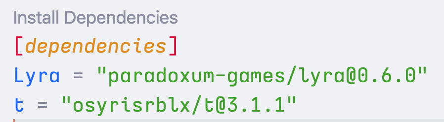

# Wally CodeLens for VS Code

A lightweight VS Code extension that adds a convenient **“Install”** button above the `[dependencies]` section inside any wally.toml file.
Clicking the button automatically runs:

```bash
wally install
```

in an integrated terminal.

## ✨ Features

- Detects `wally.toml` files in your workspace
- Shows a CodeLens labeled Install above the `[dependencies]` section
- Runs wally install with one click
- No configuration required

## 🚀 Usage

1.  Open any project containing a `wally.toml`
2.  Locate the `[dependencies]` section
3.  Click the **Install** CodeLens that appears above it

## ⚙️ Requirements

- [Wally](https://github.com/UpliftGames/wally) must be installed and available in your system PATH
- VS Code 1.70.0 or newer

## 📷 Demo


